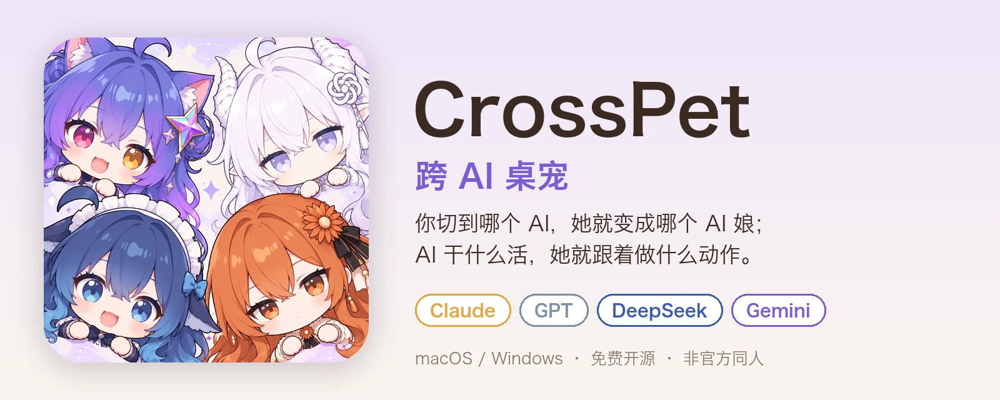
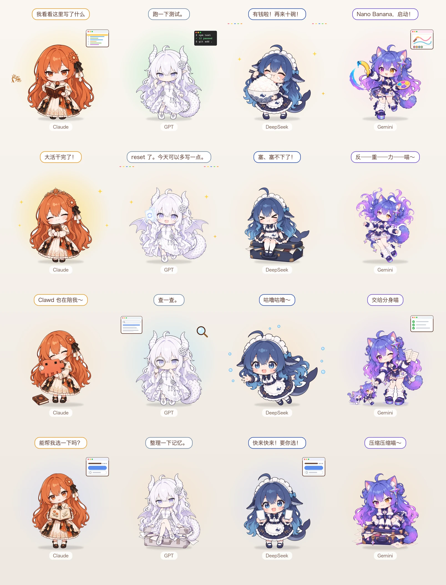
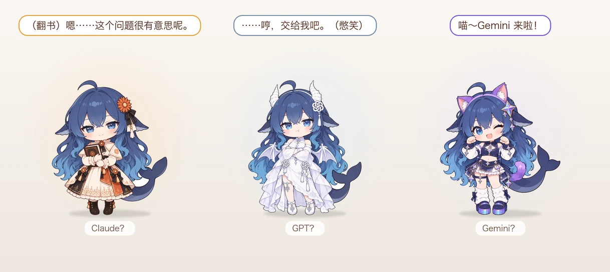

# CrossPet · 跨 AI 桌宠



[](https://github.com/lokicorvus/crosspet/releases/latest)


[](LICENSE)
[](characters/LICENSE.md)

一只浮在桌面角落的小桌宠，Mac 和 Windows 都能用。**你切到哪个 AI，她就变成哪个 AI 娘；AI 干什么活，她就跟着做什么动作。**


> 非官方同人项目，与 Anthropic、OpenAI、DeepSeek、Google、智谱、腾讯无关。角色形象来自社区二创，见 [致谢与授权](#致谢与授权)。

## 她会做什么



- **跟着 AI 干活**：思考、读文件、写代码、跑命令、上网查资料、画图、派子任务、出错、完成。每个状态都有一张立绘，身边配一个小动画（小终端、浏览器、画板、任务清单……）。一轮里用了 8 次以上工具的大活干完，她会戴上自己的皇冠得意一下；AI 压缩上下文时，她会把一大堆东西往小箱子里硬塞；AI 停下来问你问题、让你选选项或者请求授权时，她会一直看着你等你回答（Claude Code、DeepSeek Harness）。
- **看着额度**：名牌下面显示 Claude 的 5 小时 / 每周额度、GPT 的 Codex 额度、DeepSeek 的账户余额、Gemini 的 Antigravity 额度。快用完时她会露出累了的样子。
- **自己待着**：闲着会哼歌、伸懒腰、打哈欠，十分钟没动静就睡着。单击摸摸头，右键能戳她一下。有新版本时，她会举着礼物来告诉你。
- **按时段打招呼、过节换装**：早上、中午、下午、晚上、深夜、凌晨第一次见面，各有一个专属动作和台词（日出、萤火虫、星月……）；万圣节、圣诞、元旦、春节、元宵、端午、中秋、国庆当天换上节日装扮。
- **跟着 AI 出现**：接入的 AI 开始干活时，她没开着就自己出来（DeepSeek Harness 一打开就出来）。从菜单「退出」时她会挥手道别；在那之前就开着的 AI 不会再把她叫回来，重新打开 AI 或重启电脑后恢复。不想要可以在「设置…」里关掉。
- **各有性格，还懂社区梗**：
  - **Claude**：闲着会抱着 Clawd 发呆；刚出错就被你纠正时，会先来一句「You're absolutely right!」
  - **GPT**：Codex 额度在该重置之前突然满血（reset）时，平时冷静的她会难得地笑出来
  - **DeepSeek**：闲着会扒白饭、摸鱼、游泳，被戳会生气，想得太久会揉太阳穴；余额变多时抱着比脑袋还大的饭碗开吃
  - **Gemini**：生图时拿香蕉当画笔（Nano Banana）；闲着会反重力飘起来
  - **GLM**：笑眯眯的「心机涨价狐」，戳她会被抓到偷偷改价签；闲着会拉下眼罩假装自己是「神秘新模型」，或者抱着一摞售罄的会员卡得意；大活干完时掀开眼罩揭晓真身

## 支持的 AI

| AI | 自动换形象 | 跟着干活 | 额度 / 余额 |
|---|:---:|---|---|
| **Claude**（Claude Code、Claude 桌面版） | ✅ | ✅ 钩子或增强版 mod | ✅ 用增强版 mod 时 |
| **GPT**（Codex、ChatGPT 桌面版） | ✅ | ✅ Codex 钩子 | ✅ 可选，读 Codex 会话记录 |
| **DeepSeek**（DeepSeek Harness 桌面版） | ✅ | ✅ 插件 | ✅ 插件查余额（填了 API Key 或登录了账号都行；用别家服务商时不显示） |
| **Gemini**（Antigravity、Gemini 桌面版） | ✅ | ✅ Antigravity 钩子 | ✅ 可选，询问本机 Antigravity |
| **GLM**（智谱 ZCode） | ✅ | ✅ ZCode 钩子 | — |
| **WorkBuddy**（腾讯，多模型） | ✅ 按当前模型 | ✅ 钩子 | — |
| **Hermes Agent**（Nous Research，多模型） | ✅ 按当前模型 | ✅ 插件 | — |

DeepSeek Harness、WorkBuddy、ZCode、Hermes Agent 里都能用好几家的模型：换成哪家的模型，她就换成哪家的角色；没有对应角色的模型（混元、Kimi、Hermes 自家模型……）由当前角色来演。ZCode 和 WorkBuddy 的额度 / 积分只能拿你的登录凭据去问服务器，CrossPet 不碰凭据，所以不显示。Gemini 桌面版没有对外接口，切过去只会换形象；Antigravity 的桌面版和命令行都能跟着干活。「等你回答」目前认 Claude Code、DeepSeek Harness、ZCode 和 Hermes Agent：Codex 提问时不触发钩子，Antigravity 没有提问的信号。

## 快速开始

### macOS

**要求**：macOS 13 及以上，Apple 芯片和 Intel 都行。

#### 方式一：一条命令（推荐）

打开「终端」，粘贴这一行回车：

```bash
curl -fsSL https://raw.githubusercontent.com/lokicorvus/crosspet/main/get.sh | bash
```

它会下载最新版装进「应用程序」并打开，再挨个问你要接入哪些 AI（回答 `y` 或直接回车跳过）。不用 git，不用编译，**第一次打开也不用去系统设置里放行**。

> 为什么不用放行：macOS 只拦带「从网上下载」标记的文件。浏览器下载的会带这个标记，终端里用 `curl` 下载的不会。脚本内容就在仓库里的 [get.sh](get.sh)，可以先看一眼再运行。

以后想加接或撤销某个 AI：右键桌宠 →「设置…」→「接入 AI」（1.2.3 起，Mac 和 Windows 都有）。

以后**更新**：再运行一次同一行命令。**卸载**：

```bash
curl -fsSL https://raw.githubusercontent.com/lokicorvus/crosspet/main/get.sh | bash -s -- uninstall
```

#### 方式二：手动下载

1. 到 [Releases](https://github.com/lokicorvus/crosspet/releases/latest) 下载 `CrossPet-macOS.zip`，解压后把 `CrossPet.app` 拖进「应用程序」。
2. 第一次打开时 macOS 会拦一下（本项目没有付费的苹果开发者签名），按你的系统版本放行一次，以后就能正常双击：
   - **macOS 15 及以上**：双击 CrossPet，弹出「无法验证」时点「完成」；打开「系统设置 → 隐私与安全性」，拉到最下面，在「已阻止使用 CrossPet」旁边点「仍要打开」，输入开机密码，再点「打开」。
   - **macOS 13、14**：在「应用程序」里**右键点 CrossPet →「打开」→ 再点「打开」**。
3. 这样装好后，切到各个 AI 的 App 时她会换形象；想让她**跟着 AI 干活**，还要接入 AI：运行一次方式一的命令（已经装好的 App 会直接替换成同一版），或者用方式三。

#### 方式三：从源码安装

需要苹果命令行工具（没有的话运行 `xcode-select --install`）：

```bash
git clone https://github.com/lokicorvus/crosspet.git
cd crosspet
./install.sh
```

会编译、装到 `~/Applications`，然后挨个问你要接哪些 AI。只想接某一个也行：

```bash
python3 tools/integrate.py install codex     # 可选：claude-hooks、claude-mod、codex、deepseek、antigravity、gemini、workbuddy、zcode、hermes
python3 tools/integrate.py status            # 看看现在接了哪些
```

### Windows

**要求**：Windows 10（1903 及以上）或 Windows 11，x64 和 ARM64 同一个安装包（约 20 MB）。用系统自带的 WebView2 显示，不用另装运行库；极少数老系统没有 WebView2 的，第一次打开会提示去微软官网装。

1. 到 [Releases](https://github.com/lokicorvus/crosspet/releases/latest) 下载 `CrossPet-Windows.zip`，**解压到本地磁盘**（比如桌面）。
2. 双击里面的 `install.cmd`：装到 `%LOCALAPPDATA%\Programs\CrossPet`，建开始菜单快捷方式，然后自动打开。不需要管理员权限。
3. 右键桌宠 →「设置…」→「接入 AI」，把你用的 AI 逐个「接入」。

更多说明见 [Windows 说明](docs/windows.md)。

> **测试情况**：作者手边没有 Windows 电脑，Windows 版是在 Apple 芯片 Mac 上的 Parallels 虚拟机（Windows 11 ARM64）里测试的。
> 已测通过：透明显示、拖动、置顶、托盘、右键菜单、设置窗口、WorkBuddy 和 ZCode 接入、跟随前台程序换角色、Codex 和 DeepSeek Harness 接入、DeepSeek 余额、开发者控制台、一键更新。
> **还没测过**：Claude Code 增强版 mod 的额度显示、Gemini（Antigravity）额度——虚拟机里没装这两个 AI。实体 x64 电脑、Windows 10、多显示器也还没验证。遇到问题欢迎提 Issue，附上 `%LOCALAPPDATA%\CrossPet\windows.log`。

### 接入 AI 改了什么

不管用哪种方式，接入都只**添加** CrossPet 自己的条目，不碰你原有的配置，改之前都会备份，撤销后恢复原样。每个 AI 改了哪个文件、要不要重启、怎么手动接，都写在 [接入教程](docs/接入教程.md) 里。

> **Codex 用户注意**：新加的钩子要在 Codex 里输入 `/hooks` 亲自「信任」一次才会运行。
> **接入需要 python3**：macOS 自带。如果提示要安装「命令行开发者工具」，点安装就行。

## 和她互动

| 操作 | 效果 |
|---|---|
| 单击 | 摸摸头 |
| 拖动 | 换个位置（会记住） |
| 挡住东西了 | 右键 →「显示层级」改成「跟着 AI」（只在用 AI、AI 等你回答、刚干完活时浮在最上层）或「普通窗口」；全屏看视频、演示时她会自动隐藏。她周围透明的空白处点击会穿过去，不会误点到她 |
| 右键 | 菜单：摸摸头、戳一下、召唤彩蛋、换角色、显示层级、**设置…**（大小、名字显示、背景光晕、改名、额度、接入 AI、登录时启动、检查更新……）、有新版本时的「更新到 …」（按住 ⌥ 再右键，Windows 是按住 Shift 再右键，还有「开发者控制台」） |
| 托盘图标（Windows） | 右键是同一个菜单，双击让她回到右下角 |
| 菜单栏爪印图标（macOS） | 单击把她叫到最前面（被挡住、拖到看不见的地方时用），右键是同一个菜单 |
| 遇到问题 | 右键「反馈问题…」，点选是哪方面、写一句具体是哪里，就能直接发给作者 |

## 彩蛋

用 Claude、GPT 或 Gemini 的时候，偶尔会「噗」地冒出一条穿着她们衣服的 DeepSeek，装模作样地学人说话。**单击她就能揪出来**，她会慌慌张张地溜走；没人理的话，她会得意地自己走掉。

DeepSeek 和 GLM 是对手，会趁对方不在上门捣乱：用 GLM 时，DeepSeek 溜进来把价签全改成打折、坐下扒饭，被抓到就被 GLM 拽尾巴；用 DeepSeek 时，GLM 拿着全是对勾的成绩单来炫耀、偷看 DeepSeek 的设计图纸，被抓到就说「只是参考一下！」。

等不及的话，右键「召唤彩蛋」。不想被打扰，可以在「设置…」里关掉「随机彩蛋」。



## 自定义

- **改名、调大小、关掉名字**：右键 →「设置…」。名字留空就恢复默认；大小可以在 60%–160% 之间调。
- **换立绘、改台词、加新角色**：看 [自定义角色](docs/自定义角色.md)。改完可以**按住 ⌥（Windows 是 Shift）再右键**打开「开发者控制台」，把每个姿态和场景挨个过一遍。一个文件夹就是一个角色，放几张图、写个 `character.json` 就能用。
- **用 AI 画新立绘**：[角色生图提示词](docs/prompts/角色生图提示词.md) · [彩蛋生图提示词](docs/prompts/彩蛋生图提示词.md)，配好了参考图。

## 隐私

- 钩子只拿到「哪个事件、用了哪个工具」，写到本机的状态目录（macOS 是 `/tmp/crosspet/`，Windows 是 `%LOCALAPPDATA%\CrossPet\state`），不保存任何对话内容。
- GPT 额度默认关闭。打开后只从 Codex 会话记录里提取额度那几个数字。
- Gemini 额度默认关闭。打开后向本机正在运行的 Antigravity 后台服务问一次额度（和它自己界面上显示额度的方式一样），用的是它每次启动随机生成、只在本机有效的令牌，不碰你的 Google 账号凭据。
- DeepSeek 余额：插件通过 DeepSeek Harness 官方的凭据接口取 Key，只用来调官方余额接口，不写盘、不上传别处；没填 Key 时调 Harness 自己的账号服务查，登录凭据始终留在 Harness 里，插件只拿到余额数字。
- WorkBuddy、ZCode：钩子只拿到事件名、工具名和当前模型名，用来选角色；不读它们的登录凭据，所以也不显示它们的额度 / 积分。
- Hermes Agent：插件只把事件名、工具名、当前模型名和会话 id 交给钩子脚本，不传对话内容和命令参数；工具结果只看成功还是出错。
- CrossPet 自己只联网做一件事：每 3 小时（以及电脑从睡眠中醒来时）查一次 GitHub 上有没有新版本，只读公开的版本号；点「更新」时才下载安装包。

## 更新与卸载

- **一键更新（1.2.1 起）**：有新版本时她会举着礼物、在气泡里提醒你。右键点菜单顶上的「⬆️ 更新到 …」，会自动下载、安装、重新打开，设置、角色和已接入的 AI 都保留，接入也会按新版自动刷新。
- **从 1.2.0 及更早的版本升级**：旧版还没有一键更新，这一次要手动更新一下：
  - **macOS**：再运行一次「方式一」的安装命令（手动下载的，下载新的 `CrossPet-macOS.zip` 替换旧 App 也行）。
  - **Windows**：下载新的 `CrossPet-Windows.zip`，解压后再双击一次 `install.cmd` 覆盖安装。
- **从源码装的**：`./update.sh` 更新，`./uninstall.sh` 卸载。
- **卸载**：macOS 用「方式一」里的卸载命令；Windows 双击安装目录里的 `uninstall.cmd`。

遇到问题先看 [常见问题](docs/常见问题.md)。各版本改了什么见 [更新记录](CHANGELOG.md)。

## 致谢与授权

角色形象都是社区二创的再创作，CrossPet 只是把她们做成桌宠，立绘由 AI 生图工具按这些设定绘制：

- **DeepSeek 娘**：原型「溟月」由 **上善无形** 创作（2025-06，CC BY-NC-SA 4.0）；深蓝女仆鲸鱼娘（社区昵称「大肥鱼」）由 B 站 **ZipZipPipe** 二创。
- **GPT 娘（白龙）**：社区通称「御姐白龙」，出自 B 站 **ZipZipPipe**。
- **GLM 娘（黑狐狸女仆）**：CrossPet 的原创设定，「心机涨价狐」的性格取自社区对智谱的印象。
- **Gemini 娘**、**Claude 娘**：参考社区流行的 AI 娘设定（如 [ai-school-op](https://github.com/lshhhhhhh/ai-school-op)、[openpet-ai-girls](https://github.com/AwesomeHou/openpet-ai-girls)）。
- 「Claude」「GPT」「ChatGPT」「Codex」「DeepSeek」「Gemini」「Antigravity」「GLM」「ZCode」「WorkBuddy」「Hermes」是各自公司的商标，本项目仅用于指代对应产品。

如果你是原作者并且对使用方式有异议，请提 Issue，我会第一时间修改或下架。

**授权**

- 代码：[MIT](LICENSE)
- 角色立绘与设定（`characters/`、`docs/prompts/`、`docs/images/`）：[CC BY-NC-SA 4.0](characters/LICENSE.md)。可以转载和二创，须署名、**不得商用**，衍生作品用同样的协议。

README 里的配图由 `python3 tools/readme_images.py` 按 App 的真实布局生成，顶部横幅和宣传图由 `python3 tools/promo_images.py` 生成。
