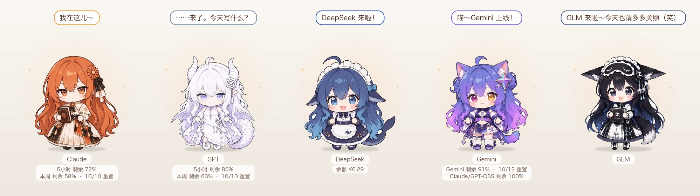

# CrossPet · 跨 AI 桌宠



一只浮在桌面上的小桌宠，**跟着你正在用的 AI 换形象，跟着 AI 的工作状态做动作**。

- 切到 Claude、ChatGPT / Codex、DeepSeek Harness、Gemini / Antigravity，桌宠自动换成对应的 AI 娘
- AI 在思考、读文件、写代码、跑命令、查资料、画图、派子任务、完成、出错……桌宠都有对应的立绘和小动画
- 名牌下显示额度：Claude 的 5 小时 / 每周额度、GPT 的 Codex 额度、DeepSeek 的账户余额；快用完时她会累
- 单击摸摸头，右键戳一下；闲着会哼歌、伸懒腰，太久没理她会睡着
- DeepSeek 有专属的吃饭、摸鱼、游泳、深度思考、生气小动作
- 彩蛋：偶尔会有一条穿着别人衣服的 DeepSeek 混进来，等你揪出她

> **非官方同人项目。** 与 Anthropic、OpenAI、DeepSeek、Google 无关。角色形象来自社区二创，详见 [致谢与授权](#致谢与授权)。

## 支持情况

| AI | 换形象 | 跟随工作状态 | 额度 / 余额 |
|---|---|---|---|
| Claude（Claude Code / Claude 桌面版） | ✅ | ✅ 标准钩子或增强版 mod | ✅ 需增强版 mod |
| GPT（Codex / ChatGPT 桌面版） | ✅ | ✅ Codex 钩子 | ✅ 可选，读取 Codex 会话记录 |
| DeepSeek（DeepSeek Harness 桌面版） | ✅ | ✅ 插件 | ✅ 插件查询余额 |
| Gemini（Antigravity / Gemini 桌面版） | ✅ | ✅ Antigravity 钩子（Gemini 桌面 App 没有接口） | — |

只支持 macOS 13 及以上（Apple 芯片和 Intel 都可以）。

## 安装

### 方式一：下载安装（推荐）

1. 到 [Releases](../../releases) 下载最新的 `CrossPet.zip`，解压，把 `CrossPet.app` 拖进「应用程序」文件夹。
2. **第一次打开要这样做**：在「应用程序」里**右键点 CrossPet →「打开」→ 再点「打开」**。
   （本项目没有付费的苹果开发者签名，macOS 第一次会提示「无法验证开发者」，这样操作一次就好，以后正常双击。）
3. 桌宠出现在屏幕右下角。接下来按 [接入教程](docs/接入教程.md) 把你用的 AI 接上。

### 方式二：从源码安装

需要苹果命令行工具（没有的话运行 `xcode-select --install`）。

```bash
git clone https://github.com/lokicorvus/crosspet.git
cd crosspet
./install.sh
```

脚本会编译、装到 `~/Applications`，然后逐个问你要接入哪些 AI。

## 使用

| 操作 | 效果 |
|---|---|
| 单击 | 摸摸头 |
| 拖动 | 移动位置（会记住） |
| 右键 | 菜单：戳一下、召唤彩蛋、换角色、**改名**、显示 GPT 额度、登录时自动启动、打开角色文件夹…… |

- 想给角色起自己的名字：右键 →「给当前角色改名…」，留空恢复默认。
- 想加新角色或替换立绘：看 [自定义角色](docs/自定义角色.md)。

## 文档

- [接入教程](docs/接入教程.md)：每个 AI 怎么接、改了哪些文件、怎么撤销
- [自定义角色](docs/自定义角色.md)：加角色、换立绘、改台词、用 AI 生图
- [常见问题](docs/常见问题.md)
- 生图提示词：[角色](docs/prompts/角色生图提示词.md) · [彩蛋](docs/prompts/彩蛋生图提示词.md)

## 更新

- **下载安装的**：有新版本时桌宠会在气泡里提醒你，右键菜单顶上会出现「⬆️ 有新版本」，点它打开下载页。下载新的 `CrossPet.zip`，替换「应用程序」里的旧 App 即可。
  已经接入的 AI（钩子脚本、DeepSeek 插件、Claude mod）会在新版第一次启动时自动更新，不用重新接入。
  也可以随时在右键菜单里点「检查更新」。
- **从源码安装的**：
  ```bash
  cd crosspet && ./update.sh
  ```
  会拉取最新代码、重新编译安装，并把已接入的 AI 按新版刷新一遍。

## 卸载

```bash
./uninstall.sh
```

会撤销所有 AI 接入（只删 CrossPet 自己加的条目，改动前都会备份），并删除 App。

## 致谢与授权

**角色形象**均为社区二创的再创作，CrossPet 只是把它们做成桌宠，所有立绘由 AI 生图工具按这些设定绘制：

- **DeepSeek 娘**：原型「溟月」由 **上善无形** 创作（2025-06，CC BY-NC-SA 4.0）；深蓝女仆鲸鱼娘（社区昵称「大肥鱼」）由 B 站 **ZipZipPipe** 二创。
- **GPT 娘（白龙）**：社区通称「御姐白龙」，出自 B 站 **ZipZipPipe**。
- **Gemini 娘**、**Claude 娘**：参考社区流行的 AI 娘设定（如 [ai-school-op](https://github.com/lshhhhhhh/ai-school-op)、[openpet-ai-girls](https://github.com/AwesomeHou/openpet-ai-girls)）。
- 「Claude」「GPT」「ChatGPT」「Codex」「DeepSeek」「Gemini」「Antigravity」是各自公司的商标，本项目仅用于指代对应产品。

如果你是原作者并且对使用方式有异议，请提 Issue，我会第一时间修改或下架。

**授权**
- 代码：[MIT](LICENSE)
- 角色立绘与设定（`characters/`、`docs/prompts/`、`docs/images/`）：[CC BY-NC-SA 4.0](characters/LICENSE.md)：可以转载和二创，须署名、**不得商用**、衍生作品用同样的协议。
